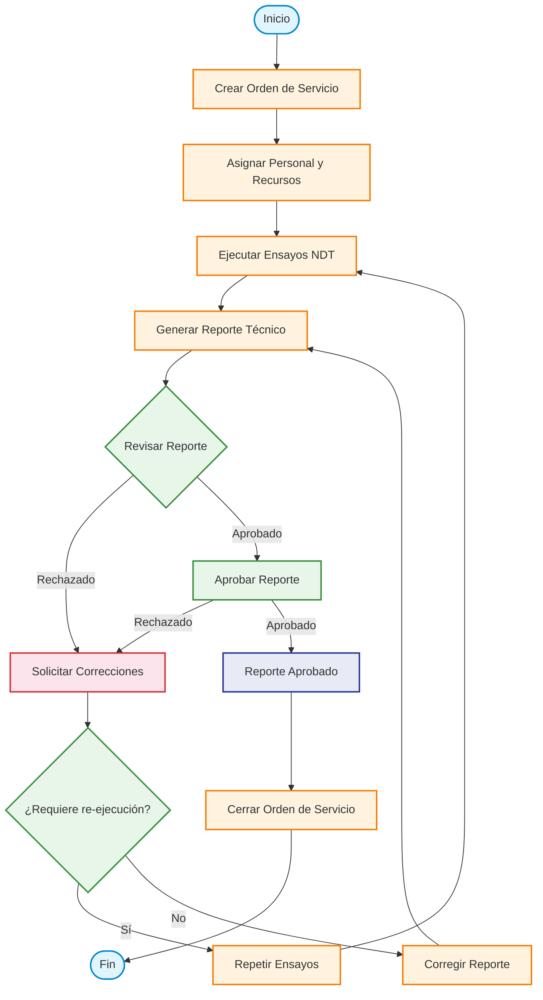

# Diagrama de Flujo — Orden de Servicio SoliWel NDT

## Descripción de Estados

| Estado | Descripción |
|--------|-------------|
| **Creación** | Se registra la orden con datos del cliente, proyecto, alcance y método NDT. |
| **Asignación** | Se asignan técnicos, equipos, instrumentos y recursos necesarios. |
| **Ejecución** | Se realizan los ensayos NDT (PT, MT, UT, VT, UTPA) in-situ o en laboratorio. |
| **Reporte** | Se genera el reporte técnico con resultados, cálculos y conclusiones. |
| **Revisión** | Un inspector/revisor verifica la calidad y completitud del reporte. |
| **Aprobación** | El supervisor o cliente final aprueba el reporte para entrega. |
| **Cierre** | Se archiva la orden, se actualiza el inventario y se factura si aplica. |

## Bucles de Corrección

- **Rechazo en Revisión**: Si el reporte tiene errores, se devuelve para corrección menor (**Corregir Reporte**) o para re-ejecución completa (**Repetir Ensayos**) si los datos son insuficientes.
- **Rechazo en Aprobación**: Similar al anterior, cualquier rechazo en aprobación dispara el subflujo de correcciones.
